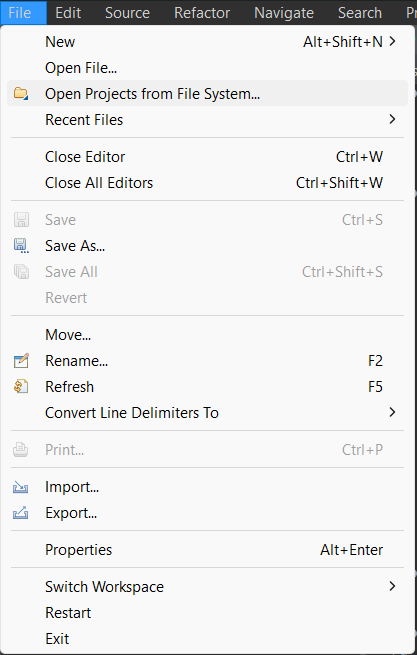
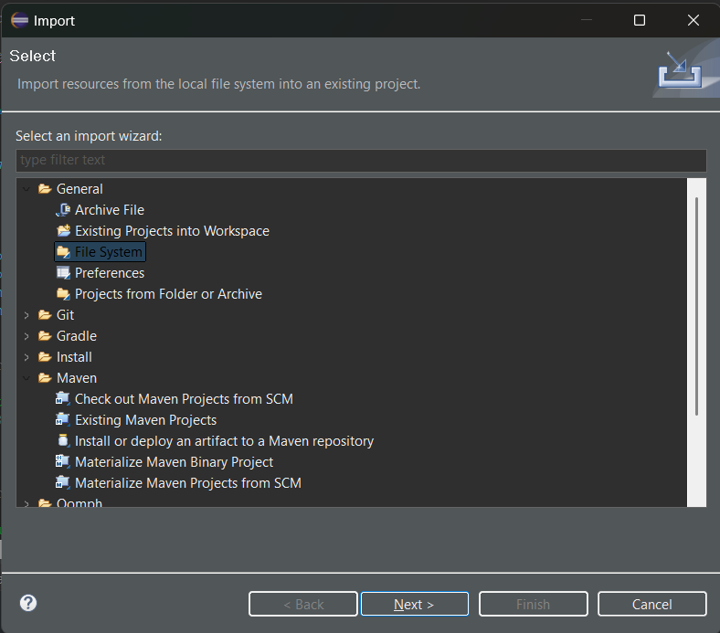
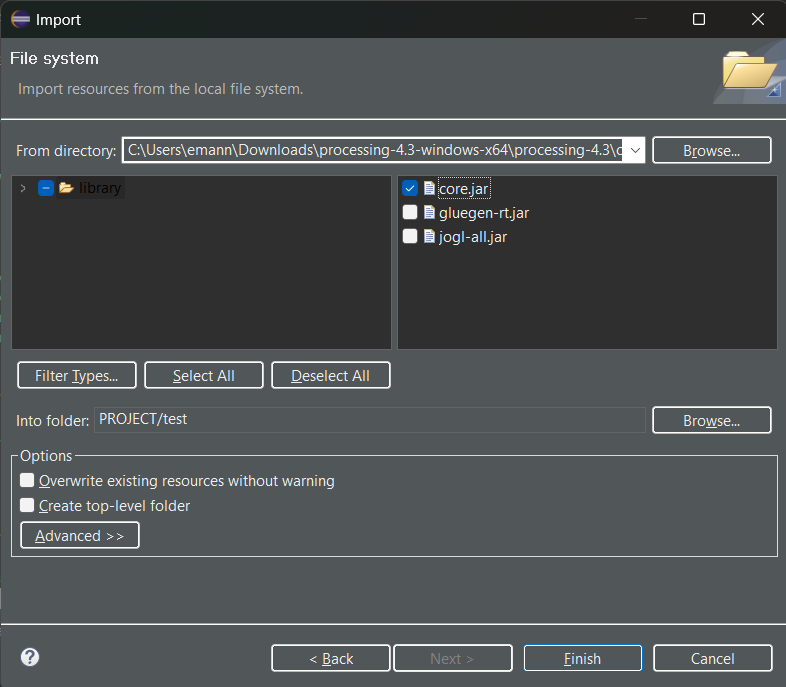
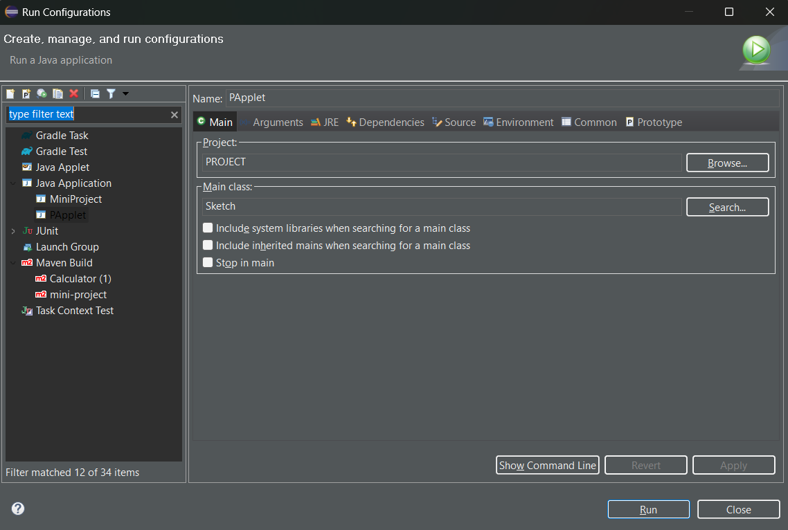

# Lindenmayer Systems
### Full Unit Project

Lindenmayer Systems were introduced for the purpose of modelling plants and 
simulating natural processes. They have the capability of producing highly advance, 
realistic productions of organic structures. Despite this program being fairly 
small-scale, even the simpler productions rendering in this program demonstrate the 
genius behind the concept.

This program presents several implementations of L-Systems. In particular, it 
implements context-free versions of deterministic and stochastic L-Systems.

The technologies used in this are:

Processing 4.3\
Java 21

### How to Use in Eclipse

Make sure you are working with Java 21.

You can download a .zip to get the project. Once downloaded, extract all files and 
open the project in Eclipse. You can do this by going to Eclipse and under File, 
select "Open Projects from File System..."

Select Directory in the pop-up window from there and select the extracted folder. 
Click Finish. The project is now on Eclipse.

To be able to run it, you need to have the `core.jar` file for Processing 4.3 
which is available [here](https://github.com/processing/processing4/releases/tag/processing-1293-4.3). 
Download the file that fits your system. 

To import into Eclipse, go through the File tab again. This time to Import. Select General > File System.

Click Browse in the next window and select the folder in which your Processing `core.jar` exists. 
Then select the core.jar in the right-hand window.

You now have the correct libraries and all the files in your working directory. Before running 
the code, you need to first make sure the correct Run Configuration is selected.

Click the arrow next to the Run icon, and select "Run Configurations". Here, make sure the Main class 
is __Sketch__.

Click Apply and then Run.
